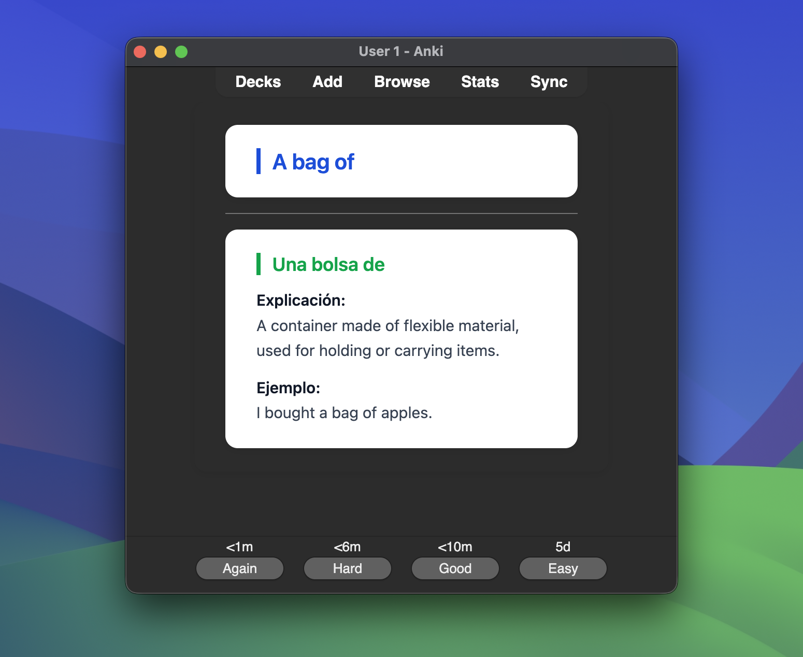

# My learning journal

    

A collection of lessons, vocabulary, and examples from my journey to learn English. Made for anyone learning from zero.

- [Vocabulary A1](./vocabulary-a1-v2.0.0.apkg) - Anki deck with A1 vocabulary.
- Follow my progress:
    - [Blog](https://italofantone.com/blog).
    - [LinkedIn](https://www.linkedin.com/in/italofantone/).
    - [Curso de inglés - Nivel A1](https://italofantone.com/english/)

**My email**: hola@italofantone.com

Made with ❤️ by Italo Morales Fantone.