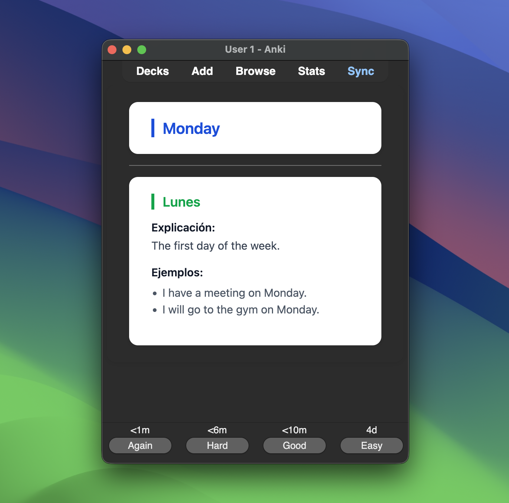

# My learning journal

    

A collection of lessons, vocabulary, and examples from my journey to learn English. Made for anyone learning from zero.

- [Google Sheets](https://docs.google.com/spreadsheets/d/1bF_NbMDEVAq2X3yuifMVMYc7LvEdrOpNWb-wTDLlXYo/edit?usp=sharing).
- [Anki deck](./initial-vocabulary-v1.0.0.apkg).
- [CSV file](./initial-vocabulary-v1.0.0.csv).
- Follow my progress:
    - [Blog](https://italofantone.com/blog).
    - [LinkedIn](https://www.linkedin.com/in/italofantone/).

### English lessons

**Level**: Zero.

- [Lesson 1: Comienza a aprender inglés: guía para principiantes](https://italofantone.com/blog/comienza-a-aprender-ingles-guia-para-principiantes)
- [Lesson 2: Vocabulario básico antes del nivel A1 de inglés](https://italofantone.com/blog/vocabulario-basico-antes-del-nivel-a1-de-ingles)

### Contributing

Feel free to contribute by opening issues or pull requests. Any help is appreciated!

**My email**: hola@italofantone.com

Made with ❤️ by Italo Morales Fantone.